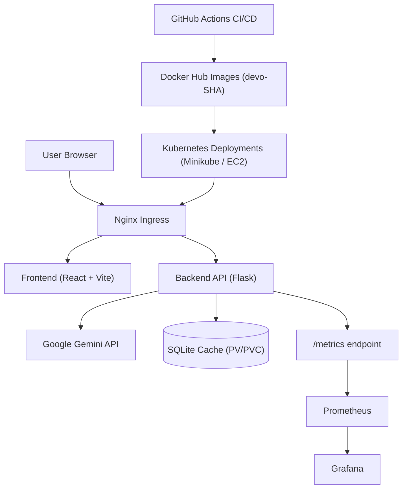

# The Nihilist's Kernel 🕳️

**The Nihilist's Kernel** is a dialogue engine that explores the intersection of computer science and philosophy. It is inspired by the dynamic between Rust Cohle and Marty Hart from *True Detective*, and uses that tension to frame conversations about technology, logic, selfhood, and meaning.

## System Architecture

## Overview

The app generates dialogues between two characters:

- **Rust Cohle** — a voice of radical doubt, existential reflection, and uncomfortable clarity
- **Marty Hart** — a grounded, pragmatic voice that pushes back with common sense and structure

The result is a strange loop: a machine producing a conversation about machines, humans, and the void in between.

## Features

- Generates philosophical dialogues with Google Gemini
- Persists generated responses in SQLite for caching
- Containerized frontend and backend with Docker
- Local orchestration with Docker Compose
- Kubernetes deployment with Minikube
- Ingress routing, persistent storage, and HPA
- Prometheus + Grafana monitoring
- GitHub Actions CI/CD with immutable image tags
- Deployed and validated on an AWS EC2 instance as well

## Tech Stack

### Frontend

- React
- Vite
- Plain CSS and minimal UI

### Backend

- Python
- Flask API
- Google Gemini API
- Flask-CORS
- Flask-SQLAlchemy

### Data

- SQLite for lightweight persistence and dialogue caching

### Infrastructure

- Docker
- Docker Compose
- Kubernetes / Minikube
- Nginx Ingress
- Persistent Volume + PVC
- Horizontal Pod Autoscaler
- Prometheus / Grafana
- GitHub Actions

## Project Philosophy

This project is not trying to be just another chatbot.

It is meant to be a mirror: a strange loop where questions about logic, memory, identity, and nothingness are reflected through a formal system that is cold, deterministic, and still strangely human in what it produces.

## Deployment Highlights

### Local Kubernetes

The app is deployed locally on Minikube with:

- backend and frontend Deployments
- Services exposed through Ingress
- SQLite persistence via PersistentVolume/PersistentVolumeClaim
- resource requests/limits
- readiness and liveness probes
- HPA for autoscaling
- Prometheus scrape support via ServiceMonitor

### AWS EC2

The same containerized setup has also been deployed on an Amazon EC2 instance, making it easy to compare a local Kubernetes environment with a simple cloud-hosted runtime.

## Suggested Ways to Run

### 1. Local development

- Run frontend and backend separately for day-to-day development.

### 2. Docker Compose

- Start both services together in containers for a quick full-stack local environment.

### 3. Kubernetes / Minikube

- Use the K8s manifests in `k8s/` to deploy the app locally with ingress, persistence, and autoscaling.

### 4. AWS EC2

- Use the same Docker-based setup on EC2 for a cloud deployment demo.

## What this repository demonstrates

- Building a full-stack app with a clean backend/frontend split
- Containerizing services for local and cloud execution
- Shipping through CI/CD with immutable image tags
- Deploying to Kubernetes with real operational concerns
- Observability, autoscaling, and persistent storage

## Notes

- The project intentionally keeps the UI minimal.
- The interesting part is the deployment and infrastructure story around the app.
- The generated dialogues are meant to feel reflective, eerie, and slightly absurd.

## License

No explicit license has been added yet.
